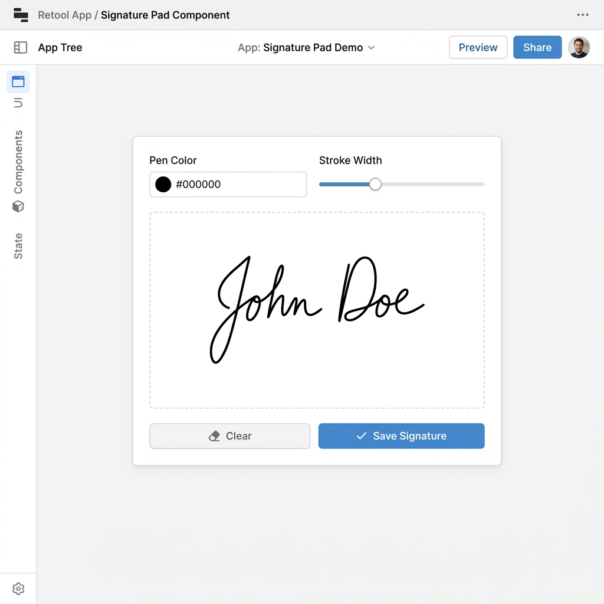

# Signature Pad

> A canvas-based signature capture component for Retool with pen color, stroke width controls, and base64 PNG output.

## Author

- **Name:** Taha Amin
- **Community Username:** @tahaamin
- **Email:** taha.internise@gmail.com

## About

Signature Pad is a custom Retool component that lets users draw their signature directly on a canvas inside a Retool app. It supports pen color selection and stroke width control, and outputs the completed signature as a base64-encoded PNG string that can be stored in a database or displayed in an image component. It is ideal for any Retool workflow that requires collecting user signatures — such as approvals, contracts, or onboarding forms.

## Tags

`UI Components`, `Forms`, `Input`, `Signature`, `Canvas`

## How It Works

The component renders an HTML5 `<canvas>` element inside a Retool custom component iframe. Mouse and touch events are captured to draw strokes on the canvas using the Canvas 2D API. When the user clicks **Save**, the canvas is exported to a base64 PNG string via `canvas.toDataURL()` and sent back to Retool using `window.Retool.modelUpdate({ signature: '...', isEmpty: false })`. The Retool app can then reference `signaturePad.model.signature` to read or store the image. A **Clear** button resets the canvas and sends an empty string back to Retool.

**Retool model output:**
- `signature` — base64 PNG data URL of the drawn signature
- `isEmpty` — boolean, `true` when the canvas has not been drawn on

**Retool model input (optional):**
- `clearSignature` — set to `true` to programmatically clear the canvas
- `penColor` — hex colour string, e.g. `#ff0000`
- `strokeWidth` — number, pen thickness in pixels

## Build Process

1. Created a self-contained HTML document with an HTML5 `<canvas>` element
2. Added mouse and touch event listeners (`mousedown`, `mousemove`, `mouseup`, `touchstart`, `touchmove`, `touchend`) directly on the canvas for cross-device support
3. Used `window.devicePixelRatio` scaling to ensure crisp rendering on high-DPI screens
4. Integrated `window.Retool.modelUpdate()` to push the signature data URL back to Retool on every stroke end and on explicit Save
5. Used `window.Retool.subscribe()` to listen for external commands like `clearSignature`, `penColor`, and `strokeWidth` from the Retool app
6. Styled with inline CSS for zero external dependencies — no npm packages required

## Demo Video

N/A

## Preview

